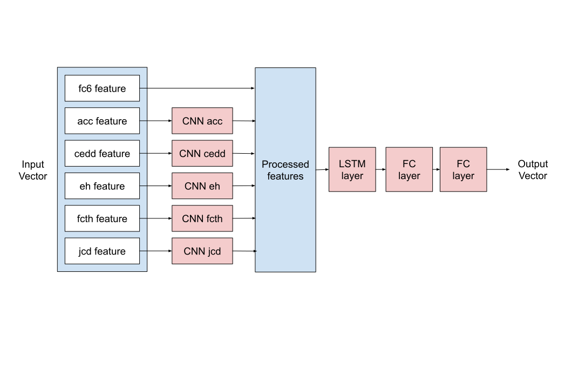
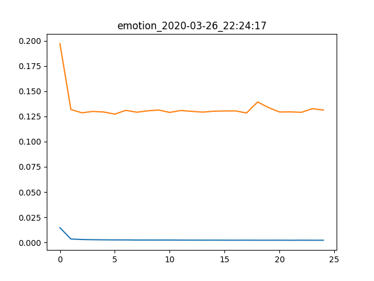

# Projet 3A : Détection d'émotions dans des séquences de films

La prédiction des émotions induites par les vidéos est une problématique assez répandue, qui peut avoir des débouchées dans les technologies de la communication, 
et notamment le marketing. En 2018, le laboratoire Liris a constitué un nouveau dataset constitué de séquences de films annotées en fonction des émotions induites
sur le spectateur. Le but de ce projet a été de continuer les travaux déjà effectués dans le cadre de la compétition MédiaEval 2018 pour la prédiction des émotions induites 
par les vidéos basée sur le dataset du laboratoire.

**Le dataset** est composé de différentes features et annotations décrites [ici](data/README.md)

## Prise en main

### Prérequis

Pour installer les dépendances, exécuter la commande suivante : 
```shell script
pip install -r requirements.txt
```

##### Dépendances du projet:

| Package  | Version |
| ------------- | ------------- |
| matplotlib  | 3.1.1  |
| numpy  | 1.16.5  |
| torch  | 1.0.1  |

### Générer les données

Télécharger l'ensemble des fichiers de MediaEval2018: [LIRIS-ACCEDE](https://liris-accede.ec-lyon.fr/), et placez-les dans le dossier ```data```de ce répertoire.

Générer les fichiers ```x_train.pickle```, ```y_train.pickle```, ```x_mean.pickle``` et ```x_std.pickle``` et executant les commandes suivantes:

```python
from read_data import dump_data
dump_data()
```

### Le modèle

Le modèle utilisé est une succession entre des CNN à l'échelle de chaque feature puis un LSTM suivi de deux couches Fully Connected


--------------------

## Lancer un entrainement

Pour lancer un entrainement, il faut executer le script ```emotion.py```.

```
usage: python emotion.py [-h] [--add-CNN] [--seq-len SEQ_LEN]
                         [--num-hidden NUM_HIDDEN] [--hidden-size HIDDEN_SIZE]
                         [--lr LR] [--batch-size BATCH_SIZE] [--grad-clip GRAD_CLIP]
                         [--nb-epoch NB_EPOCH] [-O {Adam,RMSprop,SGD}] [-B BIDIRECT]
                         [--weight-decay WEIGHT_DECAY] [-D DROPOUT]
                         [--logger-level LOGGER_LEVEL] [--fragment FRAGMENT]
                         [--features {acc,cedd,cl,eh,fcth,gabor,jcd,sc,tamura,lbp,fc6,visual,audio,all} [{acc,cedd,cl,eh,fcth,gabor,jcd,sc,tamura,lbp,fc6,visual,audio,all} ...]]
                         [--no-overlapping]

Train Neural Network for emotion predictions

optional arguments:
  -h, --help            show this help message and exit
  --add-CNN             Use the model with a first layer of CNNs
  --seq-len SEQ_LEN     Length of a sequence
  --num-hidden NUM_HIDDEN
                        Number of hidden layers in NN
  --hidden-size HIDDEN_SIZE
                        Dimension of hidden layer
  --lr LR               Learning rate
  --batch-size BATCH_SIZE
                        Size of a batch
  --grad-clip GRAD_CLIP
                        Gradient clipped between [- grad-clip, grad-clip]
  --nb-epoch NB_EPOCH   Number of epoch
  -O {Adam,RMSprop,SGD}, --optimizer {Adam,RMSprop,SGD}
                        Type of optimizer
  -B BIDIRECT, --bidirect BIDIRECT
                        Whether to use bidirectional
  --weight-decay WEIGHT_DECAY
                        L2 regularization coefficient
  -D DROPOUT, --dropout DROPOUT
                        Dropout probability between [0, 1]
  --logger-level LOGGER_LEVEL
                        Logger level: from 10 (debug) to 50 (critical)
  --fragment FRAGMENT   The percentage of the dataset used. From 0 to 1
  --features {acc,cedd,cl,eh,fcth,gabor,jcd,sc,tamura,lbp,fc6,visual,audio,all} [{acc,cedd,cl,eh,fcth,gabor,jcd,sc,tamura,lbp,fc6,visual,audio,all} ...]
                        Features used
  --no-overlapping      Forbid overlapping between sequences in dataset
```

La configuration choisie, ainsi que les résultats seront stockés dans le dossier ```results``` sous le format ```json```.

--------------------

## Analyse

Les résultats obtenus sont stockés dans le dossier ```results```.

Un utilitaire python ```show.py``` est fourni et permet de générer les graphiques associés aux entrainements.
L'utilitaire va automatiquement chercher tous les fichiers ```json``` non affichés et génère les graphiques correspondants.

Usage :
```shell script
python show.py
```



--------------------


## Auteurs

Ce projet a été réalisé en colaboration avec
* Augustin ARDON
* William BLAUFUKS
* Lucas DORMOY
* Quentin GALLOUEDEC
* Timothée HAGUENAUER

Dans le cadre d'un projet de l'Ecole Centrale de Lyon commandité par Emmanuel DELLANDREA

--------------------

## Liens utiles

- [LIRIS-ACCEDE](https://liris-accede.ec-lyon.fr/)
- [MediaEval](http://www.multimediaeval.org/)
- [Login ACCEDE](https://liris-accede.ec-lyon.fr/files/database-download/download.php)
- [Thèse Yohan Baveye](https://tel.archives-ouvertes.fr/tel-01272240/document)

--------------------
